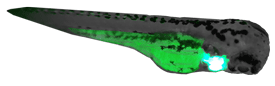

#Follow The Zebrafish

Keep your cursor with the bright zebrafish until the end of the level.  
If you hit the black background (and sometimes green), you'll die.

The zebrafish that can't fluoresce will circle in and back out
at random points.  
The zombie zebrafish will poke his head in and then randomly dart across the screen.  
Both will kill you if you get too close (or get darted at).  

You can avoid them by holding space to hide behind the zebrafish you are following.  
However, you will be hidden from view and if you don't stay with your zebrafish and hit  
black, you'll die.  

When the level ends, the background will turn blue and you need hover over blue to move on.
At any point if you want to restart the level, click on the fish you are following.